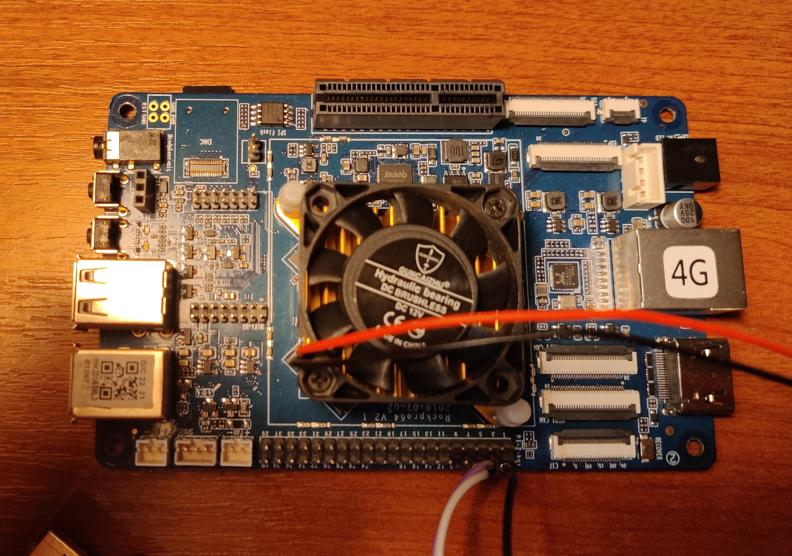
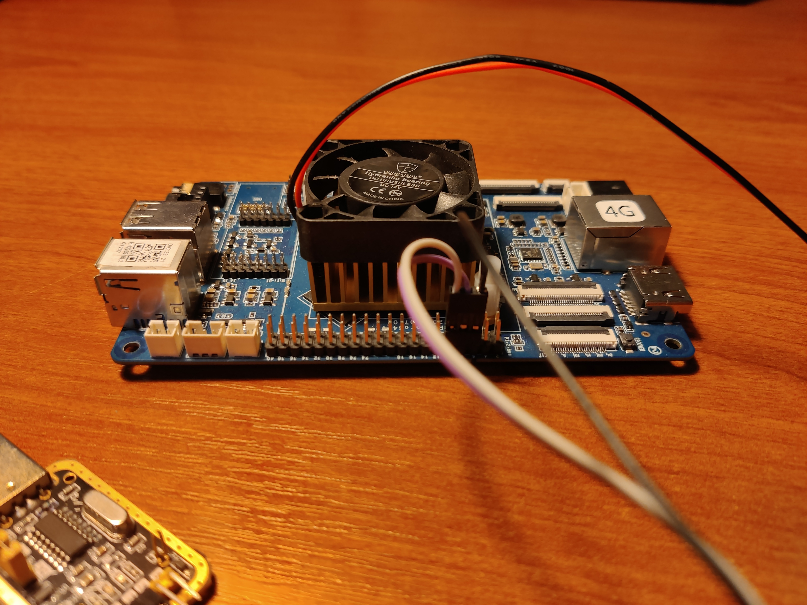
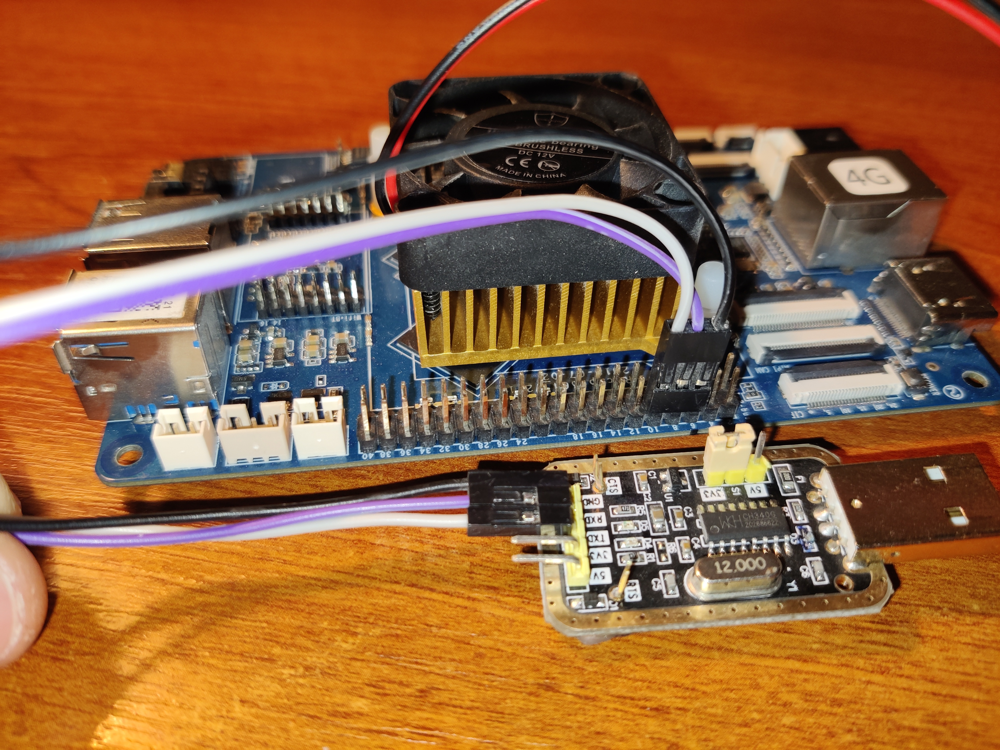
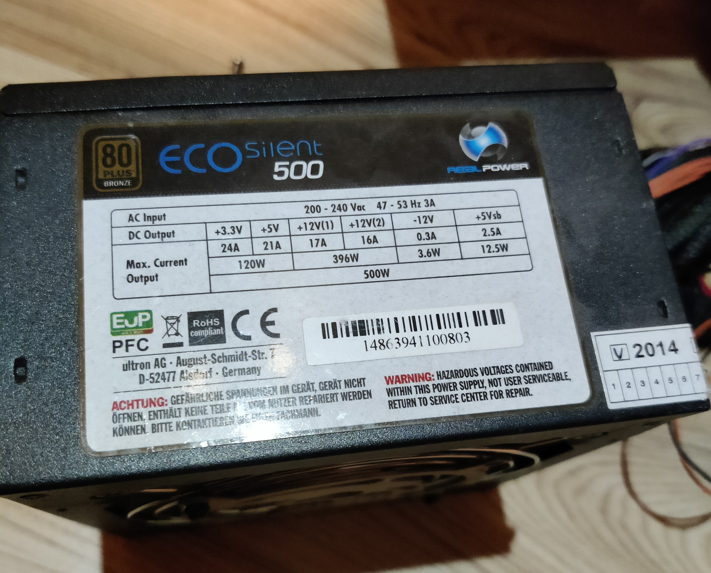
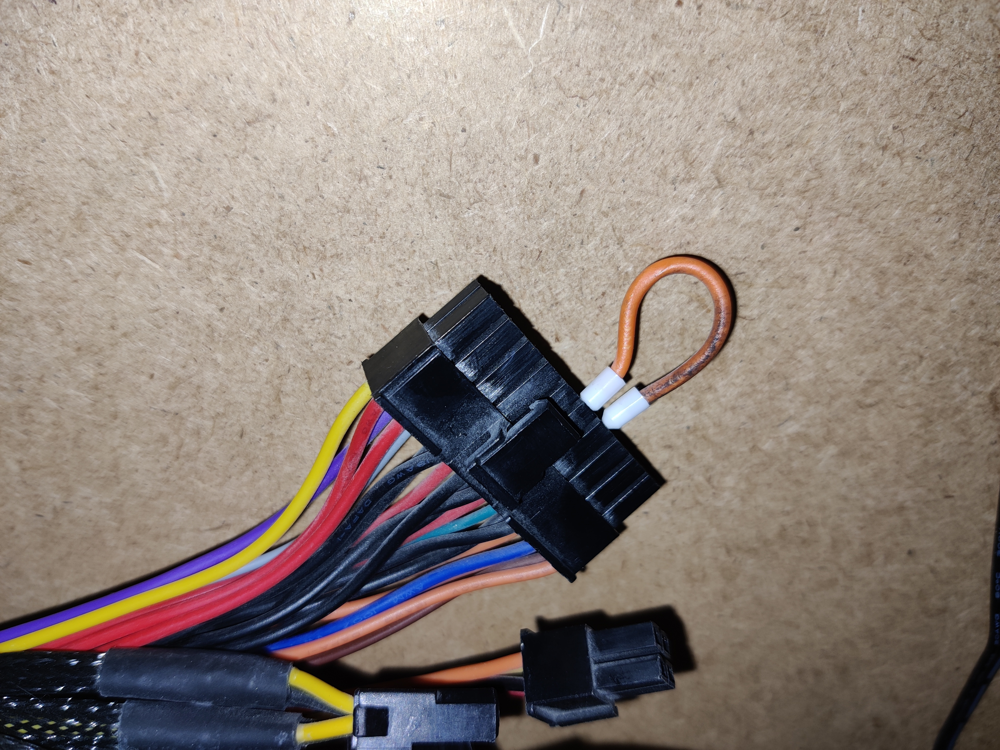
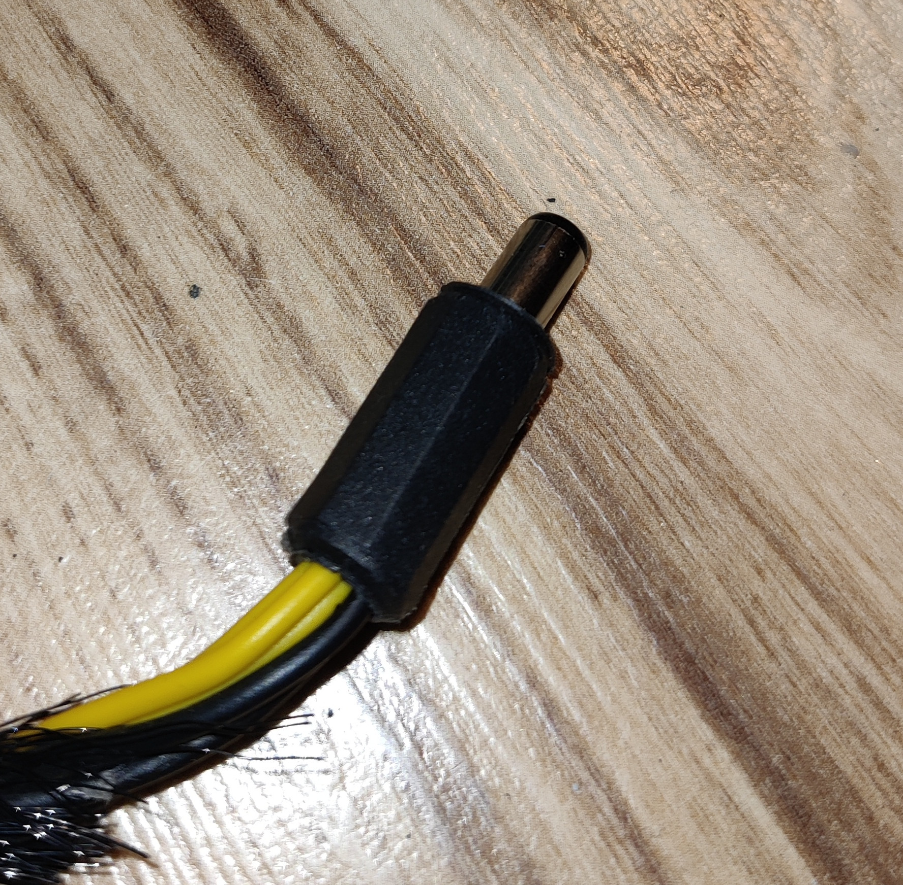
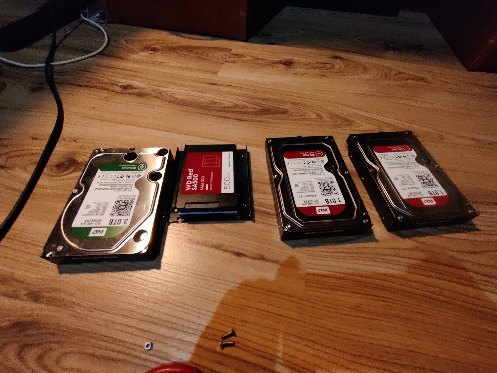
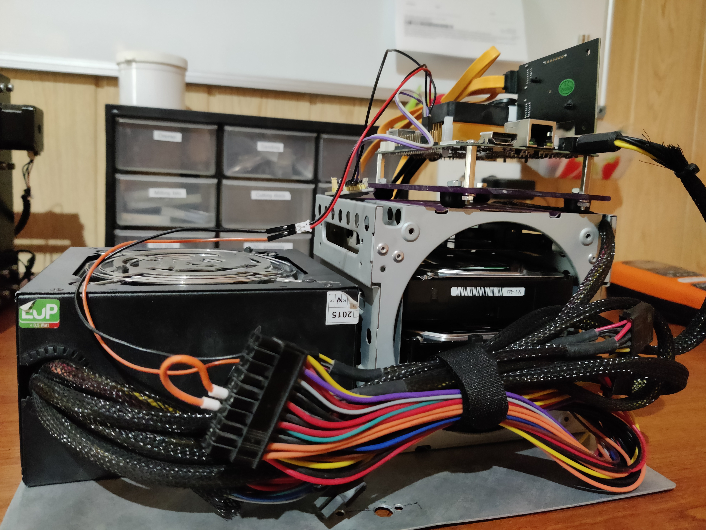
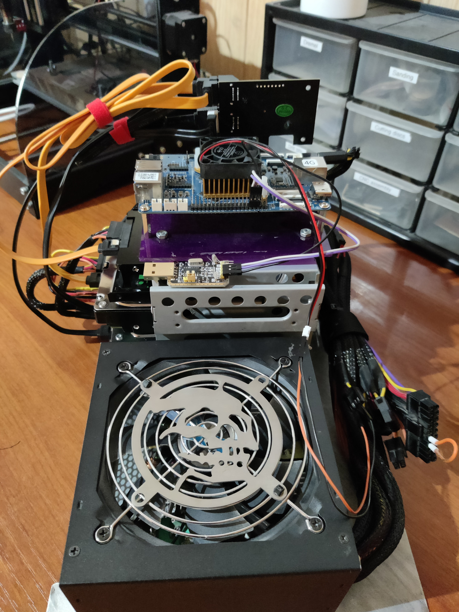
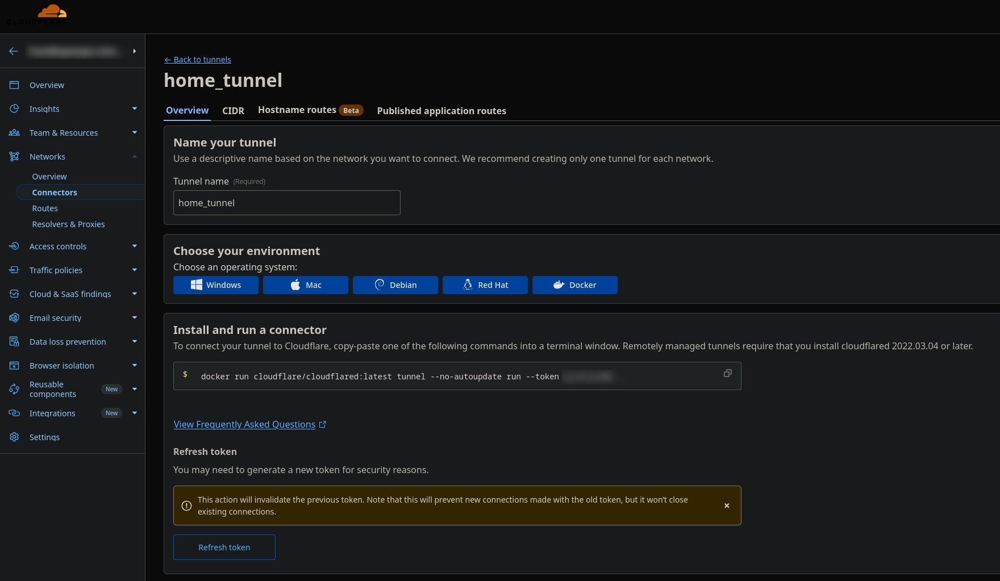

# ROCKPro64 Nextcloud setup

A comprehensive, step-by-step journal documenting how to set up a self-hosted Nextcloud 
server on a **Pine64 ROCKPro64** running Armbian Linux.

This guide walks through:

- Choosing and preparing hardware, including repurposed old PC parts for a DIY NAS
- Installing and configuring Armbian Linux
- Setting up Docker and deploying Nextcloud
- Network setup, security, and SSL configuration
- Troubleshooting and optimization for a privacy-focused, fully functional cloud solution

Perfect for anyone looking to build their own secure, self-hosted cloud storage using 
affordable SBCs and DIY components.

## Motivation

1. **Privacy and Control** – I wanted a cloud solution where my data stays under
     my control, without relying on third-party services.
2. **Repurposing Old Hardware** – I had old PC parts lying around and wanted to 
    give them a second life as a DIY NAS.
3. **Learning and Experimentation** – Setting up Nextcloud on Armbian allowed me
 to deepen my understanding of Linux, Docker, networking, and home server management.
4. **Customizability** – Running my own server gives me the flexibility to tailor
 the system to my needs, from storage structure to security measures.
5. **Cost-Effective Solution** – Using affordable hardware like the Pine64 
ROCKPro64 and existing parts made this a budget-friendly way to host my own cloud.

Building this server has been both a practical project and a learning experience, 
resulting in a secure, private, and fully functional cloud solution for personal use.

## Hardware setup

### ROCKPro64

For this project, I chose the Pine64 ROCKPro64 single-board computer as the heart of my self-hosted Nextcloud server.
It consumes far less power than a full PC, making it ideal for 24/7 operation. The ROCKPro64 comes equipped with Gigabit Ethernet, ensuring stable data transfer speeds within the local network, and — crucially — it includes a PCIe slot, offering great flexibility for custom integrations.
In my case, I utilized this slot to add a SATA expansion board for additional storage connectivity.

I opted for the 4 GB RAM version to provide better performance and to accommodate potential future improvements, such as running additional Docker containers or background services alongside Nextcloud.

<br>
<div align="center">
    
</div>
<br>

ROCKPro64 doesn’t typically suffer from overheating under light or moderate loads, I decided to mount an active cooler (small fan + heatsink) to ensure stable operation under continuous 24/7 use. Since the board will be running Nextcloud, Docker containers, and other background services, sustained CPU activity can cause temperatures to rise, especially inside an enclosed case or during heavy file transfers.

Adding active cooling helps maintain consistent performance, prevents thermal throttling, and slightly extends the overall lifespan of the board. It’s a small investment for long-term reliability.

<br>
<div align="center">
    
</div>
<br>

To make development and troubleshooting easier, I connected a USB-to-UART serial module to the ROCKPro64’s debug header.
This allows direct access to the system’s UART console, which is essential for monitoring boot messages, recovering from misconfigurations, or debugging issues when SSH or network access is unavailable. Detailed description is available [here](https://pine64.org/documentation/ROCKPro64/Getting_started/#setup-a-serial-console-uart2)

<br>
<div align="center">
    
</div>
<br>

During the setup process, having serial access proved invaluable, especially when configuring Armbian for the first time and verifying that the system booted correctly from the chosen storage medium (microSD or eMMC). It also provides a simple way to view kernel logs and manage the board before any network configuration is complete.

Although Pine64 has an active community, it doesn’t match the scale of the Raspberry Pi ecosystem. Still, considering its performance-to-price ratio and hardware capabilities, the ROCKPro64 stands out as an excellent alternative for developers seeking more power and flexibility in their self-hosted setups.

### Power Supply

For the power supply, I decided to reuse an old ATX PSU that’s been sitting on a shelf for years, waiting for a second life. It’s a 500W unit, which is complete overkill for the ROCKPro64, but it has plenty of SATA connectors — perfect for powering multiple drives in my setup. Plus, it’s reliable and already tested, so why not put it back to work?
<br>
<div align="center">
    
</div>
<br>

To get an ATX PSU to power on without a motherboard, you need to short the green wire (PS_ON) to any ground wire (black) on the main 24-pin connector. A simple jumper wire does the trick.

<br>
<div align="center">
    
</div>
<br>

Since the ROCKPro64 runs on 12V DC through a barrel jack, I repurposed one of the CPU power connectors from the PSU.
After checking the pinout a few times (just to be safe!), I crimped it to a barrel jack connector — and it worked perfectly.
Now the board powers directly from the ATX supply, keeping everything neat and powered from a single source.

<br>
<div align="center">
    
</div>
<br>

### Disks and Assembly

For storage, I wanted to take full advantage of the four SATA ports on the PCIe expansion board.I connected three HDDs and one SSD, mixing parts I already had lying around. The plan was to have a clean split between data, backups, and container storage:

- 🟥 2× WD Red 1TB HDDs — main data storage
- 🟩 1× WD Green 3TB HDD — dedicated to Borg backups (more on this later)
- 🟥 1× WD Red SSD — for containers and system stuff

<br> <div align="center">  </div> <br>

I used disk mounting bracket i salvaged from an old PC to securely fix disk. I also screwed on plexiglass panel to use it as holder for ROCKpro.

<br>
<p align="center">
    
    
</p>
<br>

Every component is mounted on an aluminium sheet that serves as a sturdy base and helps with heat dissipation.It also keeps the build modular — I can easily detach or rearrange parts if I decide to upgrade or rewire anything later.

<br>
<p align="center">
    
    
</p>
<p align="center">
    
</p>
<p align="center">

</p>
<br>

In the end it’s a bit of a Frankenstein build — old drives, reused PSU, random cables - but that’s part of the fun.The goal wasn’t to build a shiny commercial NAS, but something modular, hackable, and entirely mine.

## Software Setup

### Operating System Installation

For the operating system, I went with **Armbian**, which is a lightweight Debian-based distro optimized for ARM boards like the ROCKPro64. I started by downloading the latest Armbian CLI image (no desktop environment) from the [official site](https://www.armbian.com/rockpro64/).

#### Flashing the Image

Since this system will run headless 24/7, there's no need for a GUI, so I downloaded a minimal Armbian image. Once the image was ready, I flashed it to a microSD card using **balenaEtcher**, though you can use any tool like `dd` or even **Raspberry Pi Imager**.

```bash
# Alternative: Using dd (Linux/macOS)
sudo dd if=Armbian_*.img of=/dev/sdX bs=4M status=progress
sync
```

**Note:** Replace `/dev/sdX` with your actual SD card device. Double-check with `lsblk` to avoid overwriting the wrong drive.

#### First Boot

After inserting the microSD card into the ROCKPro64 and powering it on, I connected via the serial console to monitor startup logs. The first boot takes a bit longer as Armbian resizes the filesystem and performs initial setup.

Default credentials (if not using serial):
- **Username:** `root`
- **Password:** `1234`

You'll be prompted to change the root password and create a new user on first login.

### Initial System Configuration

After the first boot, I connected via the serial console to monitor startup logs and complete the initial setup — setting up my user, hostname, SSH server. For those not skillful enough, me included, Armbian has an equivalent of Raspberry's `raspi-config` originally named `armbian-config` that lets you configure your settings in a more intuitive way through **ncurses** based **TUI**.

```bash
sudo armbian-config
```

Key configurations I made:
- **System → Hostname** — Set a meaningful hostname (e.g., `rockpro-nas`)
- **Network → IP** — Configured static IP address for reliable access, something I did on my local router/switch
- **Personal → Timezone** — Set correct timezone
- **Software → Headers** — Installed kernel headers (needed for some drivers)

Before proceeding, I made sure everything was up to date and I'm running the latest version of Armbian:

```bash
sudo apt update && sudo apt upgrade -y
sudo apt install -y htop iotop tmux vim curl wget git
```

### Storage Configuration

With four drives connected via the PCIe SATA adapter, I needed to organize storage logically. My setup:
- **SSD** — System and Docker containers (`/var/lib/docker`)
- **2× 1TB HDDs** — RAID1 for Nextcloud data (`/mnt/nextcloud-data`)
- **1× 3TB HDD** — Backup storage (`/mnt/backup`)

#### Identifying Disks

First, I identified all connected drives:

```bash
lsblk -o NAME,SIZE,TYPE,MOUNTPOINT,MODEL
```

Output example:
```
NAME        SIZE TYPE MOUNTPOINT        MODEL
sda       238.5G disk                   WD Red SSD
sdb         1TB disk                   WD Red HDD
sdc         1TB disk                   WD Red HDD
sdd         3TB disk                   WD Green HDD
mmcblk0    29.7G disk                   
└─mmcblk0p1 29.5G part /              
```

#### Creating RAID1 for Data Drives

I used `mdadm` to create a software RAID1 array with the two 1TB drives:

```bash
# Install mdadm
sudo apt install -y mdadm

# Create RAID1 array
sudo mdadm --create --verbose /dev/md0 --level=1 --raid-devices=2 /dev/sdb /dev/sdc

# Monitor RAID sync progress
watch cat /proc/mdstat
```

Wait for the sync to complete (can take several hours for large drives).

#### Formatting and Mounting

Once the RAID array was synced:

```bash
# Format RAID array as ext4
sudo mkfs.ext4 /dev/md0

# Format SSD for Docker
sudo mkfs.ext4 /dev/sda

# Format backup drive
sudo mkfs.ext4 /dev/sdd

# Create mount points
sudo mkdir -p /mnt/nextcloud-data
sudo mkdir -p /mnt/docker
sudo mkdir -p /mnt/backup

# Get UUIDs for fstab
sudo blkid
```

#### Configuring fstab

To ensure drives mount automatically on boot:
```bash
sudo vim /etc/fstab
```

```
# SD card / mount
UUID=xxxxxxxx-xxxx-xxxx-xxxx-xxxxxxxxxxxx / ext4 defaults,noatime,commit=600,errors=remount-ro 0 1

# HDD storage drive RAID
UUID=yyyyyyyy-yyyy-yyyy-yyyy-yyyyyyyyyyyy /mnt/raid1 ext4 defaults,nofail,x-systemd.device-timeout=5 0 2


# SSD storage for Docker stuff
UUID=zzzzzzzz-zzzz-zzzz-zzzz-zzzzzzzzzzzz /mnt/WDred_ssd  ext4  defaults,nofail,x-systemd.device-timeout=5  0  2


# HDD backup
UUID=xxxxxxxx-xxxx-xxxx-xxxx-xxxxxxxxxxxx /mnt/wd_hdd ext4  defaults,nofail,x-systemd.device-timeout=5  0  2


# w
tmpfs /tmp tmpfs defaults,nosuid 0 0
```

Mount everything:
```bash
sudo mount -a
```

Verify:
```bash
df -h
```

### Docker installation

Docker is the foundation for running Nextcloud and its dependencies (database, Redis, etc.) in isolated containers.


```bash
# Install prerequisites
sudo apt install -y apt-transport-https ca-certificates curl gnupg lsb-release

# Add Docker's official GPG key
curl -fsSL https://download.docker.com/linux/debian/gpg | sudo gpg --dearmor -o /usr/share/keyrings/docker-archive-keyring.gpg

# Add Docker repository
echo "deb [arch=arm64 signed-by=/usr/share/keyrings/docker-archive-keyring.gpg] https://download.docker.com/linux/debian $(lsb_release -cs) stable" | sudo tee /etc/apt/sources.list.d/docker.list > /dev/null

# Install Docker
sudo apt update
sudo apt install -y docker-ce docker-ce-cli containerd.io docker-compose-plugin

# Add user to docker group (avoid using sudo for every command)
sudo usermod -aG docker $USER

# Log out and back in for group changes to take effect
```

Verify installation:
```bash
docker --version
docker compose version
```
#### Moving Docker Data to SSD

Due to the fact that SD cards have limited write cycles and are slower than SSDs. Docker constantly writes logs, image layers, and container data, which quickly wears out the SD card and slows down the system. By moving Docker to the SSD, I extended the SD card's lifespan (which now only hosts the OS), gained significantly better container performance, and reduced the risk of data corruption from card abuse. SSDs are designed for intensive write operations and are much more reliable for these workloads .

Now that Docker is installed, let's move its data directory to the SSD:

```bash
# Stop Docker
sudo systemctl stop docker

# Move existing data
sudo rsync -aP /var/lib/docker/ /mnt/WDred_ssd/docker/

# Configure Docker daemon
sudo nano /etc/docker/daemon.json
```

Add:
```json
{
  "data-root": "/mnt/WDred_ssd/docker",
  "log-driver": "json-file",
  "log-opts": {
    "max-size": "10m",
    "max-file": "3"
  }
}
```

Start Docker:
```bash
sudo systemctl start docker
sudo systemctl enable docker

# Verify new location
docker info | grep "Docker Root Dir
Docker Root Dir: /mnt/WDred_ssd/docker
```

### Nextcloud Deployment

For this setup, I chose Nextcloud All-in-One (AIO) instead of manually orchestrating separate containers. AIO is an official Docker container that bundles Nextcloud with all required services (PostgreSQL, Redis, Apache, Collabora, Talk, etc.) and handles configuration automatically. This significantly simplifies deployment and maintenance.

Why Nextcloud AIO?

- Batteries included — Everything needed for a full-featured Nextcloud instance in one container
- Automatic updates — Built-in Watchtower keeps all components up to date
- Integrated backup — Uses Borg backup internally with easy restore functionality
- Optimized performance — Pre-configured with proper caching and database settings
- Less complexity — No need to manage multiple containers and their interconnections

#### Docker compose configuration
  
First i created a dedicated directory for the Nextcloud AIO setup and cloned [Nextcloud All-In-One repository](https://github.com/nextcloud/all-in-one.git
):

```bash
mkdir -p ~/nextcloud_aio
cd ~/nextcloud_aio
git clone https://github.com/nextcloud/all-in-one.git
cp all-in-one/compose.yaml docker-compose-proxy.yaml
```

I used the official AIO docker-compose template with modifications for my hardware setup. Copied original compose file to docker-compose-proxy.yaml and modified it according to my setup (i suggest you to leave whole compose as it is and just uncomment and modify needed lines). Key configuration points in my setup:

```yaml
services:
  nextcloud-aio-mastercontainer:
    image: nextcloud/all-in-one:latest
    init: true
    restart: always
    container_name: nextcloud-aio-mastercontainer
    volumes:
      - nextcloud_aio_mastercontainer:/mnt/docker-aio-config
      - /var/run/docker.sock:/var/run/docker.sock:ro
      - /mnt/borgbackup:/mnt/wd_hdd  # Mounted 3TB WD Green for backups
    ports:
      - 8080:8080  # AIO interface
    environment:
      - APACHE_PORT=11000  # Internal Apache port for reverse proxy
      - APACHE_IP_BINDING=127.0.0.1  # Bind to localhost (Cloudflare Tunnel)
      - NEXTCLOUD_DATADIR=/mnt/raid1/nextcloud  # RAID1 array for data
```
Important configurations:

* NEXTCLOUD_DATADIR=/mnt/raid1/nextcloud — Points Nextcloud's data directory to the RAID1 array (2× 1TB WD Red drives). ⚠️ This must be set before initial installation and cannot be changed afterward without complications.
* APACHE_PORT=11000 and APACHE_IP_BINDING=127.0.0.1 — Configured for use with Cloudflare Tunnel as a reverse proxy. The AIO container runs Apache internally on port 11000, accessible only from localhost.
* /mnt/borgbackup:/mnt/wd_hdd — Mounts the 3TB WD Green HDD into the container, allowing AIO's built-in Borg backup to use it for automated backups.

```bash
cd ~/nextcloud_aio
docker compose -f docker-compose-proxy.yaml up -d

# Check logs
docker logs -f nextcloud-aio-mastercontainer
```

Once the mastercontainer is running, access the AIO admin interface:

```
http://192.168.x.x:8080
```
On first access, AIO provides a randomly generated password. Copy and save it securely — you'll need it to access the interface.
Through the AIO interface, I:

1. Configured the domain name (cloud.yourdomain.com)
2. Selected optional containers for your special use case
3. Configured backup settings to use the mounted /mnt/wd_hdd directory
4. Started the Nextcloud installation

### Nginx Proxy Manager Setup

While Nextcloud AIO includes Apache internally, I decided to add Nginx Proxy Manager as an additional reverse proxy layer in front of it. This provides several advantages: the ability to host multiple services on the same machine with proper routing through an easy-to-use web interface, additional caching and security headers, and future-proofing for when I want to add more self-hosted applications. Having Nginx Proxy Manager as a centralized entry point makes it easier to manage SSL/TLS settings, rate limiting, and access control in one place rather than configuring each service individually.

Unlike traditional nginx configuration files, NPM provides a clean web interface for managing proxy hosts, SSL certificates, access lists, and more. It's perfect for homelab environments where you want professional features without the complexity of editing config files (if you don't want to).


#### Setting up Nginx Proxy Manager

Nginx comes packaged as an Docker image jc21/nginx-proxy-manager:latest available on Dockerhub so you should just run it as a Docker container:

```bash
mkdir -p ~/nginx-proxy-manager
cd ~/nginx-proxy-manager
vim docker-compose.yml
```
Docker Compose configuration:

```yaml
version: '3.8'

services:
  app:
    image: 'jc21/nginx-proxy-manager:latest'
    container_name: nginx-proxy-manager
    restart: unless-stopped
    ports:
      - '80:80'      # HTTP
      - '443:443'    # HTTPS
      - '81:81'      # Admin interface
    volumes:
      - ./data:/data
      - ./letsencrypt:/etc/letsencrypt
    environment:
      DB_SQLITE_FILE: "/data/database.sqlite"
```
Start the container:
```bash
docker compose up -d
```

Access the admin interface at http://192.168.x.x:81
Default credentials:

Email: admin@example.com
Password: changeme

Change these immediately after first login!
Configuring Nextcloud Proxy Host:
Through the NPM web interface, I created a new Proxy Host:

Domain Names: cloud.yourdomain.com
Scheme: http
Forward Hostname/IP: nextcloud-aio-apache (or 127.0.0.1 if using host network)
Forward Port: 11000
Websockets Support: ✓ Enabled (required for Nextcloud Talk)

### Cloudflare Tunnel Setup

To access Nextcloud securely from anywhere without opening ports on my router or dealing with dynamic DNS, I used Cloudflare Tunnel. This was especially important because my ISP uses CGNAT (Carrier-Grade NAT), which makes traditional port forwarding impossible. I spent my entire nerve balance negotiating with my ISP (hint: name starts with an *'A'* and ends with *'1'*) to install my own network equipment, which made me appreciate the elegance of Cloudflare Tunnel and provided a more elegant solution that doesn't rely on ISP cooperation. 

#### How Cloudflare Tunnel Works

Instead of exposing your server directly to the internet, Cloudflare Tunnel establishes an outbound connection from your server to Cloudflare's network. All incoming traffic is routed through Cloudflare's infrastructure, which acts as a secure gateway. This provides several key benefits:

- No port forwarding required — Works behind any NAT, including CGNAT
- DDoS protection — Cloudflare's network absorbs attacks before they reach your server
- Free SSL certificates — Automatic HTTPS with Cloudflare's certificates
- Hidden origin IP — Your home IP address is never exposed
- Access control — Can add authentication layers through Cloudflare Zero Trust

**Prerequisites**
- A domain managed by Cloudflare (free plan works perfectly)
- Cloudflare account
- Domain DNS pointed to Cloudflare nameservers

#### Installing cloudflared

I used the cloudflared Docker image for all setup steps, including tunnel creation and authentication.Cloudflare has the step by step guide creating and configuring your Cloudflare tunnel daemon (using environment of your choice) through their *one.dash.cloudflare* web UI and after selecting Docker you will be presented by *docker run* command with your token you need to run:

<br>
<div align="center">
    
</div>
<br>

I created folder and docker compose file for that purpose:
```bash
mkdir cloudflared_tunnel && cd cludflared_tunnel
vim docker-compose.yml

# add this
version: '3'

services:
  cloudflared:
    image: cloudflare/cloudflared:latest
    container_name: cloudflare-tunnel
    restart: unless-stopped
    command: tunnel run --token /####your_token#####/
    network_mode: host

# run it 
docker compose up -d

# Verify
docker logs cloudflared-tunnel
```