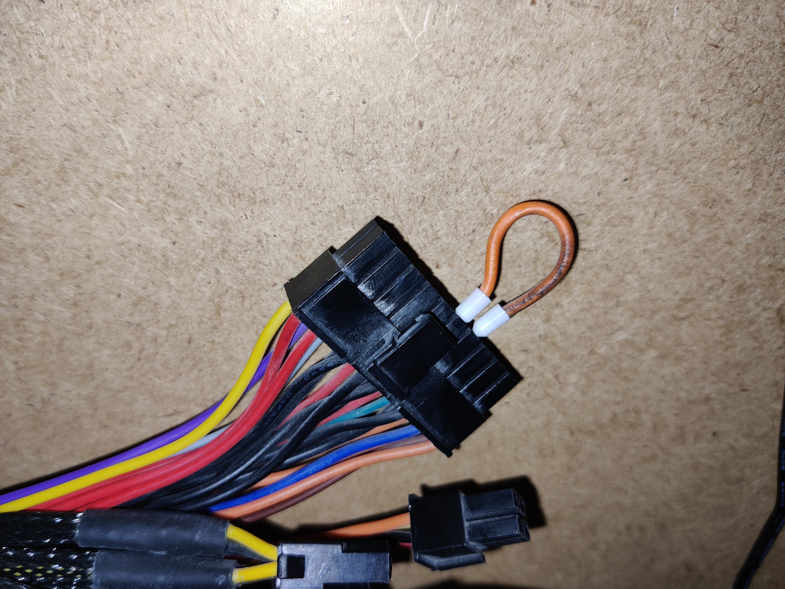
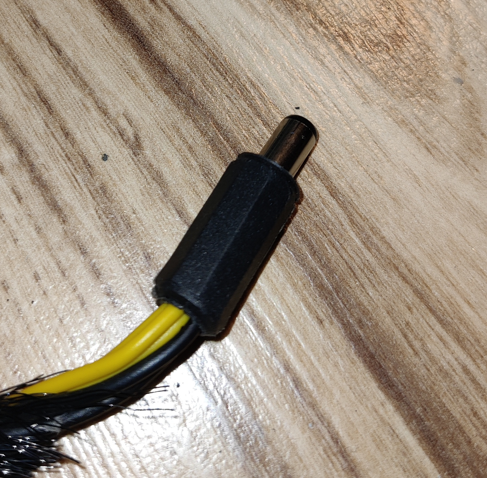
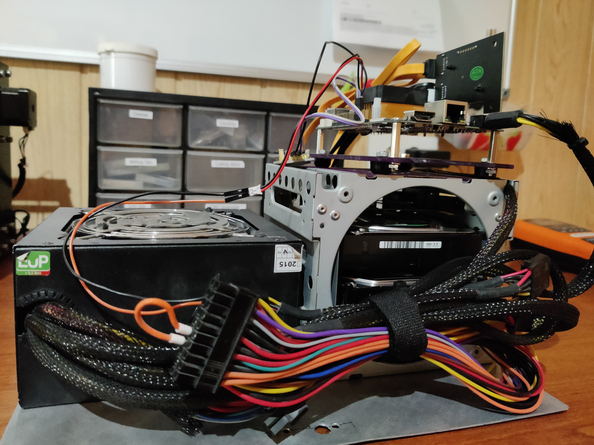
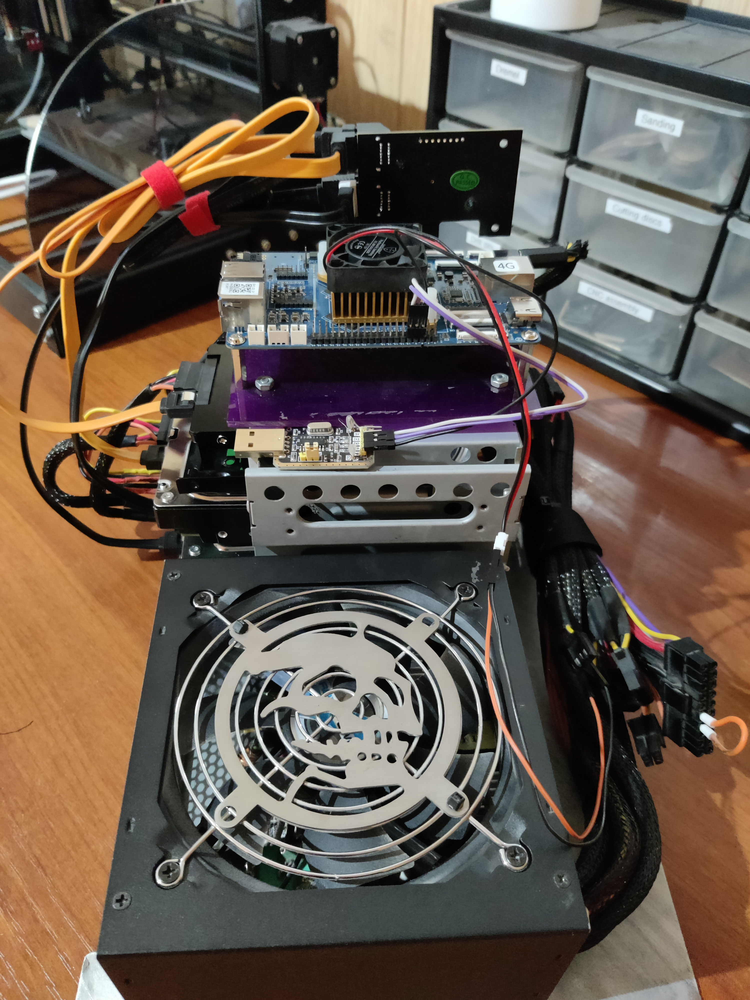

# ROCKPro64 Nextcloud Setup

A comprehensive, step-by-step journal documenting how to set up a self-hosted Nextcloud server on a **Pine64 ROCKPro64** running Armbian Linux.

This guide walks through:

* Choosing and preparing hardware, including repurposed old PC parts for a DIY NAS
* Installing and configuring Armbian Linux
* Setting up Docker and deploying Nextcloud
* Network setup, security, and SSL configuration
* Troubleshooting and optimization for a privacy-focused, fully functional cloud solution

Perfect for anyone looking to build their own secure, self-hosted cloud storage using affordable SBCs and DIY components.

---

## Table of Contents

- [Motivation](#motivation)
- [Hardware Setup](#hardware-setup)
  - [ROCKPro64](#rockpro64)
  - [Power Supply](#power-supply)
  - [Disks and Assembly](#disks-and-assembly)
- [Software Setup](#software-setup)
  - [Operating System Installation](#operating-system-installation)
  - [Initial System Configuration](#initial-system-configuration)
  - [Storage Configuration](#storage-configuration)
  - [Docker Installation](#docker-installation)
  - [Nextcloud Deployment](#nextcloud-deployment)
  - [Cloudflare Tunnel Setup](#cloudflare-tunnel-setup)
  - [Backup Strategy](#backup-strategy)
  - [Security Hardening](#security-hardening)
- [Maintenance and Monitoring](#maintenance-and-monitoring)
- [Troubleshooting](#troubleshooting)
- [Resources](#resources)

---

## Motivation

1. **Privacy and Control** – I wanted a cloud solution where my data stays under my control, without relying on third-party services.
2. **Repurposing Old Hardware** – I had old PC parts lying around and wanted to give them a second life as a DIY NAS.
3. **Learning and Experimentation** – Setting up Nextcloud on Armbian allowed me to deepen my understanding of Linux, Docker, networking, and home server management.
4. **Customizability** – Running my own server gives me the flexibility to tailor the system to my needs, from storage structure to security measures.
5. **Cost-Effective Solution** – Using affordable hardware like the Pine64 ROCKPro64 and existing parts made this a budget-friendly way to host my own cloud.

Building this server has been both a practical project and a learning experience, resulting in a secure, private, and fully functional cloud solution for personal use.

---

## Hardware Setup

### ROCKPro64

For this project, I chose the Pine64 ROCKPro64 single-board computer as the heart of my self-hosted Nextcloud server. It consumes far less power than a full PC, making it ideal for 24/7 operation. The ROCKPro64 comes equipped with Gigabit Ethernet, ensuring stable data transfer speeds within the local network, and — crucially — it includes a PCIe slot, offering great flexibility for custom integrations. In my case, I utilized this slot to add a SATA expansion board for additional storage connectivity.

I opted for the 4 GB RAM version to provide better performance and to accommodate potential future improvements, such as running additional Docker containers or background services alongside Nextcloud.


ROCKPro64 doesn't typically suffer from overheating under light or moderate loads, I decided to mount an active cooler (small fan + heatsink) to ensure stable operation under continuous 24/7 use. Since the board will be running Nextcloud, Docker containers, and other background services, sustained CPU activity can cause temperatures to rise, especially inside an enclosed case or during heavy file transfers.

Adding active cooling helps maintain consistent performance, prevents thermal throttling, and slightly extends the overall lifespan of the board. It's a small investment for long-term reliability.


To make development and troubleshooting easier, I connected a USB-to-UART serial module to the ROCKPro64's debug header. This allows direct access to the system's UART console, which is essential for monitoring boot messages, recovering from misconfigurations, or debugging issues when SSH or network access is unavailable. Detailed description is available [here](https://pine64.org/documentation/ROCKPro64/Getting_started/#setup-a-serial-console-uart2).


During the setup process, having serial access proved invaluable, especially when configuring Armbian for the first time and verifying that the system booted correctly from the chosen storage medium (microSD or eMMC). It also provides a simple way to view kernel logs and manage the board before any network configuration is complete.

Although Pine64 has an active community, it doesn't match the scale of the Raspberry Pi ecosystem. Still, considering its performance-to-price ratio and hardware capabilities, the ROCKPro64 stands out as an excellent alternative for developers seeking more power and flexibility in their self-hosted setups.

### Power Supply

For the power supply, I decided to reuse an old ATX PSU that's been sitting on a shelf for years, waiting for a second life. It's a 500W unit, which is complete overkill for the ROCKPro64, but it has plenty of SATA connectors — perfect for powering multiple drives in my setup. Plus, it's reliable and already tested, so why not put it back to work?


To get an ATX PSU to power on without a motherboard, you need to short the green wire (PS_ON) to any ground wire (black) on the main 24-pin connector. A simple jumper wire does the trick.



Since the ROCKPro64 runs on 12V DC through a barrel jack, I repurposed one of the CPU power connectors from the PSU. After checking the pinout a few times (just to be safe!), I crimped it to a barrel jack connector — and it worked perfectly. Now the board powers directly from the ATX supply, keeping everything neat and powered from a single source.



### Disks and Assembly

For storage, I wanted to take full advantage of the four SATA ports on the PCIe expansion board. I connected three HDDs and one SSD, mixing parts I already had lying around. The plan was to have a clean split between data, backups, and container storage:

* 🟥 2× WD Red 1TB HDDs — main data storage
* 🟩 1× WD Green 3TB HDD — dedicated to Borg backups (more on this later)
* 🟥 1× WD Red SSD — for containers and system stuff


I used disk mounting bracket I salvaged from an old PC to securely fix disks. I also screwed on plexiglass panel to use it as holder for ROCKPro.


Every component is mounted on an aluminium sheet that serves as a sturdy base and helps with heat dissipation. It also keeps the build modular — I can easily detach or rearrange parts if I decide to upgrade or rewire anything later.







In the end it's a bit of a Frankenstein build — old drives, reused PSU, random cables - but that's part of the fun. The goal wasn't to build a shiny commercial NAS, but something modular, hackable, and entirely mine.

---

## Software Setup

### Operating System Installation

For the operating system, I went with **Armbian**, which is a lightweight Debian-based distro optimized for ARM boards like the ROCKPro64. I started by downloading the latest Armbian CLI image (no desktop environment) from the [official site](https://www.armbian.com/rockpro64/).

#### Flashing the Image

Since this system will run headless 24/7, there's no need for a GUI, so I downloaded a minimal Armbian image. Once the image was ready, I flashed it to a microSD card using **balenaEtcher**, though you can use any tool like `dd` or even **Raspberry Pi Imager**.

```bash
# Alternative: Using dd (Linux/macOS)
sudo dd if=Armbian_*.img of=/dev/sdX bs=4M status=progress
sync
```

**Note:** Replace `/dev/sdX` with your actual SD card device. Double-check with `lsblk` to avoid overwriting the wrong drive.

#### First Boot

After inserting the microSD card into the ROCKPro64 and powering it on, I connected via the serial console to monitor startup logs. The first boot takes a bit longer as Armbian resizes the filesystem and performs initial setup.

Default credentials (if not using serial):
- **Username:** `root`
- **Password:** `1234`

You'll be prompted to change the root password and create a new user on first login.

### Initial System Configuration

After the first boot, I connected via the serial console to monitor startup logs and complete the initial setup — setting up my user, hostname, SSH server. For those not skillful enough, me included, Armbian has an equivalent of Raspberry's `raspi-config` originally named `armbian-config` that lets you configure your settings in a more intuitive way through **ncurses** based **TUI**.

#### Running armbian-config

```bash
sudo armbian-config
```

Key configurations I made:
- **System → Hostname** — Set a meaningful hostname (e.g., `rockpro-nas`)
- **Network → IP** — Configured static IP address for reliable access
- **Personal → Timezone** — Set correct timezone
- **Software → Headers** — Installed kernel headers (needed for some drivers)

#### Network Configuration

I set a static IP to ensure the NAS is always accessible at the same address:

```bash
sudo nano /etc/network/interfaces
```

Added:
```
auto eth0
iface eth0 inet static
    address 192.168.1.100
    netmask 255.255.255.0
    gateway 192.168.1.1
    dns-nameservers 1.1.1.1 8.8.8.8
```

Then restarted networking:
```bash
sudo systemctl restart networking
```

#### SSH Hardening

For better security, I configured SSH with key-based authentication:

```bash
# On your local machine, generate SSH key if you don't have one
ssh-keygen -t ed25519 -C "your_email@example.com"

# Copy public key to the server
ssh-copy-id username@192.168.1.100

# On the server, disable password authentication
sudo nano /etc/ssh/sshd_config
```

Key changes in `sshd_config`:
```
PermitRootLogin no
PasswordAuthentication no
PubkeyAuthentication yes
```

Restart SSH:
```bash
sudo systemctl restart sshd
```

#### System Updates

Before proceeding, I made sure everything was up to date:

```bash
sudo apt update && sudo apt upgrade -y
sudo apt install -y htop iotop tmux vim curl wget git
```

### Storage Configuration

With four drives connected via the PCIe SATA adapter, I needed to organize storage logically. My setup:
- **SSD** — System and Docker containers (`/var/lib/docker`)
- **2× 1TB HDDs** — RAID1 for Nextcloud data (`/mnt/nextcloud-data`)
- **1× 3TB HDD** — Backup storage (`/mnt/backup`)

#### Identifying Disks

First, I identified all connected drives:

```bash
lsblk -o NAME,SIZE,TYPE,MOUNTPOINT,MODEL
```

Output example:
```
NAME        SIZE TYPE MOUNTPOINT        MODEL
sda       238.5G disk                   WD Red SSD
sdb         1TB disk                   WD Red HDD
sdc         1TB disk                   WD Red HDD
sdd         3TB disk                   WD Green HDD
mmcblk0    29.7G disk                   
└─mmcblk0p1 29.5G part /              
```

#### Creating RAID1 for Data Drives

I used `mdadm` to create a software RAID1 array with the two 1TB drives:

```bash
# Install mdadm
sudo apt install -y mdadm

# Create RAID1 array
sudo mdadm --create --verbose /dev/md0 --level=1 --raid-devices=2 /dev/sdb /dev/sdc

# Monitor RAID sync progress
watch cat /proc/mdstat
```

Wait for the sync to complete (can take several hours for large drives).

#### Formatting and Mounting

Once the RAID array was synced:

```bash
# Format RAID array as ext4
sudo mkfs.ext4 /dev/md0

# Format SSD for Docker
sudo mkfs.ext4 /dev/sda

# Format backup drive
sudo mkfs.ext4 /dev/sdd

# Create mount points
sudo mkdir -p /mnt/nextcloud-data
sudo mkdir -p /mnt/docker
sudo mkdir -p /mnt/backup

# Get UUIDs for fstab
sudo blkid
```

#### Configuring fstab

To ensure drives mount automatically on boot:

```bash
sudo nano /etc/fstab
```

Added entries (replace UUIDs with your own from `blkid`):
```
UUID=xxxxx-xxxx-xxxx-xxxx-xxxxxxxxx /mnt/nextcloud-data ext4 defaults,nofail 0 2
UUID=yyyyy-yyyy-yyyy-yyyy-yyyyyyyyy /mnt/docker ext4 defaults,nofail 0 2
UUID=zzzzz-zzzz-zzzz-zzzz-zzzzzzzzz /mnt/backup ext4 defaults,nofail 0 2
```

Mount everything:
```bash
sudo mount -a
```

Verify:
```bash
df -h
```

#### Moving Docker Directory

To use the SSD for Docker:

```bash
# Stop Docker first (we'll install it in the next step)
# This is just preparation

# Create symlink
sudo mkdir -p /mnt/docker/docker
```

We'll configure this properly after Docker installation.

### Docker Installation

Docker is the foundation for running Nextcloud and its dependencies (database, Redis, etc.) in isolated containers.

#### Installing Docker

```bash
# Install prerequisites
sudo apt install -y apt-transport-https ca-certificates curl gnupg lsb-release

# Add Docker's official GPG key
curl -fsSL https://download.docker.com/linux/debian/gpg | sudo gpg --dearmor -o /usr/share/keyrings/docker-archive-keyring.gpg

# Add Docker repository
echo "deb [arch=arm64 signed-by=/usr/share/keyrings/docker-archive-keyring.gpg] https://download.docker.com/linux/debian $(lsb_release -cs) stable" | sudo tee /etc/apt/sources.list.d/docker.list > /dev/null

# Install Docker
sudo apt update
sudo apt install -y docker-ce docker-ce-cli containerd.io docker-compose-plugin

# Add user to docker group (avoid using sudo for every command)
sudo usermod -aG docker $USER

# Log out and back in for group changes to take effect
```

Verify installation:
```bash
docker --version
docker compose version
```

#### Moving Docker Data to SSD

Now that Docker is installed, let's move its data directory to the SSD:

```bash
# Stop Docker
sudo systemctl stop docker

# Move existing data
sudo rsync -aP /var/lib/docker/ /mnt/docker/docker/

# Configure Docker daemon
sudo nano /etc/docker/daemon.json
```

Add:
```json
{
  "data-root": "/mnt/docker/docker",
  "log-driver": "json-file",
  "log-opts": {
    "max-size": "10m",
    "max-file": "3"
  }
}
```

Start Docker:
```bash
sudo systemctl start docker
sudo systemctl enable docker

# Verify new location
docker info | grep "Docker Root Dir"
```

### Nextcloud Deployment

Now comes the main event — deploying Nextcloud using Docker Compose with a complete stack including PostgreSQL database and Redis cache.

#### Project Structure

Created a dedicated directory for the Nextcloud setup:

```bash
mkdir -p ~/nextcloud-docker
cd ~/nextcloud-docker
```

#### Docker Compose Configuration

Created `docker-compose.yml`:

```bash
nano docker-compose.yml
```

Here's the complete configuration:

```yaml
version: '3.8'

services:
  db:
    image: postgres:15-alpine
    container_name: nextcloud-db
    restart: unless-stopped
    volumes:
      - /mnt/docker/nextcloud/db:/var/lib/postgresql/data
    environment:
      - POSTGRES_DB=nextcloud
      - POSTGRES_USER=nextcloud
      - POSTGRES_PASSWORD=your_secure_db_password_here
    networks:
      - nextcloud-network

  redis:
    image: redis:7-alpine
    container_name: nextcloud-redis
    restart: unless-stopped
    command: redis-server --requirepass your_secure_redis_password_here
    networks:
      - nextcloud-network

  app:
    image: nextcloud:latest
    container_name: nextcloud-app
    restart: unless-stopped
    ports:
      - "8080:80"
    volumes:
      - /mnt/docker/nextcloud/html:/var/www/html
      - /mnt/nextcloud-data:/var/www/html/data
    environment:
      - POSTGRES_HOST=db
      - POSTGRES_DB=nextcloud
      - POSTGRES_USER=nextcloud
      - POSTGRES_PASSWORD=your_secure_db_password_here
      - REDIS_HOST=redis
      - REDIS_HOST_PASSWORD=your_secure_redis_password_here
      - NEXTCLOUD_ADMIN_USER=admin
      - NEXTCLOUD_ADMIN_PASSWORD=your_secure_admin_password_here
      - NEXTCLOUD_TRUSTED_DOMAINS=localhost 192.168.1.100 your-domain.com
      - OVERWRITEPROTOCOL=https
    depends_on:
      - db
      - redis
    networks:
      - nextcloud-network

  cron:
    image: nextcloud:latest
    container_name: nextcloud-cron
    restart: unless-stopped
    volumes:
      - /mnt/docker/nextcloud/html:/var/www/html
      - /mnt/nextcloud-data:/var/www/html/data
    entrypoint: /cron.sh
    depends_on:
      - db
      - redis
    networks:
      - nextcloud-network

networks:
  nextcloud-network:
    driver: bridge
```

**Important:** Replace all password placeholders with strong, unique passwords.

#### Creating Required Directories

```bash
sudo mkdir -p /mnt/docker/nextcloud/{db,html}
sudo chown -R 33:33 /mnt/docker/nextcloud/html  # www-data user
sudo chown -R 999:999 /mnt/docker/nextcloud/db   # postgres user
```

#### Starting Nextcloud

```bash
cd ~/nextcloud-docker
docker compose up -d

# Check logs
docker compose logs -f
```

#### Initial Setup

Once all containers are running, access Nextcloud via browser:
```
http://192.168.1.100:8080
```

The initial setup wizard should be bypassed since we're using environment variables, but you can log in with the admin credentials you set in the compose file.

#### Nextcloud Configuration Tweaks

To optimize performance and enable additional features, I edited the Nextcloud config:

```bash
docker exec -it nextcloud-app bash
nano /var/www/html/config/config.php
```

Key additions:
```php
  'memcache.local' => '\\OC\\Memcache\\APCu',
  'memcache.distributed' => '\\OC\\Memcache\\Redis',
  'memcache.locking' => '\\OC\\Memcache\\Redis',
  'redis' => [
    'host' => 'redis',
    'password' => 'your_secure_redis_password_here',
    'port' => 6379,
  ],
  'default_phone_region' => 'HR',
  'maintenance_window_start' => 1,
```

Exit the container and restart:
```bash
docker compose restart app
```

### Cloudflare Tunnel Setup

To access Nextcloud securely from anywhere without opening ports on my router, I used **Cloudflare Tunnel** (formerly Argo Tunnel). This creates an encrypted tunnel from the ROCKPro64 to Cloudflare's edge network.

#### Prerequisites

- A domain managed by Cloudflare (free plan works)
- Cloudflare account

#### Installing cloudflared

```bash
# Download cloudflared for ARM64
wget https://github.com/cloudflare/cloudflared/releases/latest/download/cloudflared-linux-arm64.deb

# Install
sudo dpkg -i cloudflared-linux-arm64.deb

# Verify
cloudflared --version
```

#### Authenticating cloudflared

```bash
cloudflared tunnel login
```

This opens a browser where you authorize cloudflared with your Cloudflare account.

#### Creating a Tunnel

```bash
# Create tunnel
cloudflared tunnel create nextcloud-tunnel

# Note the Tunnel ID from the output
```

This creates credentials in `~/.cloudflared/` with a UUID.

#### Configuring the Tunnel

Created tunnel configuration:

```bash
mkdir -p ~/.cloudflared
nano ~/.cloudflared/config.yml
```

Configuration:
```yaml
tunnel: <YOUR-TUNNEL-ID>
credentials-file: /home/username/.cloudflared/<YOUR-TUNNEL-ID>.json

ingress:
  - hostname: cloud.yourdomain.com
    service: http://localhost:8080
  - service: http_status:404
```

Replace:
- `<YOUR-TUNNEL-ID>` with your actual tunnel ID
- `username` with your actual username
- `cloud.yourdomain.com` with your actual domain

#### DNS Configuration

Route your domain through the tunnel:

```bash
cloudflared tunnel route dns nextcloud-tunnel cloud.yourdomain.com
```

This automatically creates a CNAME record in Cloudflare DNS pointing to your tunnel.

#### Running cloudflared as a Service

To keep the tunnel running 24/7:

```bash
sudo cloudflared service install
sudo systemctl start cloudflared
sudo systemctl enable cloudflared

# Check status
sudo systemctl status cloudflared
```

#### Updating Nextcloud Trusted Domains

Since Nextcloud will now be accessed via your domain, update trusted domains:

```bash
docker exec -u www-data nextcloud-app php occ config:system:set trusted_domains 0 --value=localhost
docker exec -u www-data nextcloud-app php occ config:system:set trusted_domains 1 --value=192.168.1.100
docker exec -u www-data nextcloud-app php occ config:system:set trusted_domains 2 --value=cloud.yourdomain.com
docker exec -u www-data nextcloud-app php occ config:system:set overwriteprotocol --value=https
```

Now you can access Nextcloud securely via `https://cloud.yourdomain.com` from anywhere!

### Backup Strategy

For backups, I use **Borg Backup** — a deduplicating backup program that's perfect for incremental backups with encryption.

#### Why Borg?

- **Deduplication** — Only stores changed data, saving tons of space
- **Encryption** — All backups are encrypted
- **Compression** — Reduces backup size significantly
- **Incremental** — Fast backups after the initial full backup

#### Installing Borg

```bash
sudo apt install -y borgbackup
```

#### Initializing Backup Repository

```bash
# Create backup directory
sudo mkdir -p /mnt/backup/nextcloud-borg

# Initialize repository with encryption
sudo borg init --encryption=repokey /mnt/backup/nextcloud-borg

# Save the passphrase securely!
```

#### Creating Backup Script

Created `/usr/local/bin/backup-nextcloud.sh`:

```bash
sudo nano /usr/local/bin/backup-nextcloud.sh
```

Script content:
```bash
#!/bin/bash

# Configuration
BORG_REPO="/mnt/backup/nextcloud-borg"
export BORG_PASSPHRASE='your_borg_passphrase_here'
BACKUP_SOURCES="/mnt/nextcloud-data /mnt/docker/nextcloud"
LOG_FILE="/var/log/nextcloud-backup.log"

# Logging function
log() {
    echo "[$(date +'%Y-%m-%d %H:%M:%S')] $1" | tee -a "$LOG_FILE"
}

log "Starting Nextcloud backup..."

# Enable maintenance mode
docker exec -u www-data nextcloud-app php occ maintenance:mode --on

# Create backup
borg create \
    --verbose \
    --stats \
    --compression lz4 \
    --exclude-caches \
    "$BORG_REPO::nextcloud-{now}" \
    $BACKUP_SOURCES

BACKUP_EXIT=$?

# Disable maintenance mode
docker exec -u www-data nextcloud-app php occ maintenance:mode --off

if [ $BACKUP_EXIT -eq 0 ]; then
    log "Backup completed successfully"
else
    log "Backup failed with exit code $BACKUP_EXIT"
fi

# Prune old backups (keep last 7 daily, 4 weekly, 6 monthly)
log "Pruning old backups..."
borg prune \
    --verbose \
    --list \
    --keep-daily=7 \
    --keep-weekly=4 \
    --keep-monthly=6 \
    "$BORG_REPO"

log "Backup process completed"
```

Make it executable:
```bash
sudo chmod +x /usr/local/bin/backup-nextcloud.sh
```

#### Scheduling Automated Backups

Created a cron job to run backups daily at 2 AM:

```bash
sudo crontab -e
```

Added:
```
0 2 * * * /usr/local/bin/backup-nextcloud.sh
```

#### Testing the Backup

```bash
sudo /usr/local/bin/backup-nextcloud.sh
```

Check logs:
```bash
tail -f /var/log/nextcloud-backup.log
```

#### Listing Backups

```bash
export BORG_PASSPHRASE='your_borg_passphrase_here'
borg list /mnt/backup/nextcloud-borg
```

#### Restoring from Backup

If disaster strikes:

```bash
# List available backups
borg list /mnt/backup/nextcloud-borg

# Extract specific backup
borg extract /mnt/backup/nextcloud-borg::nextcloud-2024-12-17T02:00:00

# Or mount the backup to browse files
sudo mkdir /mnt/borg-mount
borg mount /mnt/backup/nextcloud-borg::nextcloud-2024-12-17T02:00:00 /mnt/borg-mount

# When done browsing
borg umount /mnt/borg-mount
```

### Security Hardening

A few additional security measures I implemented:

#### Firewall Configuration

```bash
# Install UFW
sudo apt install -y ufw

# Default policies
sudo ufw default deny incoming
sudo ufw default allow outgoing

# Allow SSH
sudo ufw allow 22/tcp

# Allow Nextcloud (only from local network)
sudo ufw allow from 192.168.1.0/24 to any port 8080 proto tcp

# Enable firewall
sudo ufw enable

# Check status
sudo ufw status verbose
```

#### Fail2Ban for SSH Protection

```bash
# Install fail2ban
sudo apt install -y fail2ban

# Create custom config
sudo nano /etc/fail2ban/jail.local
```

Configuration:
```ini
[DEFAULT]
bantime = 3600
findtime = 600
maxretry = 3

[sshd]
enabled = true
port = 22
filter = sshd
logpath = /var/log/auth.log
```

Start service:
```bash
sudo systemctl enable fail2ban
sudo systemctl start fail2ban

# Check status
sudo fail2ban-client status sshd
```

#### Automatic Security Updates

```bash
sudo apt install -y unattended-upgrades

# Configure
sudo dpkg-reconfigure -plow unattended-upgrades
```

#### Docker Container Updates

Created update script `/usr/local/bin/update-containers.sh`:

```bash
#!/bin/bash
cd /home/username/nextcloud-docker
docker compose pull
docker compose up -d
docker image prune -f
```

Added to cron for weekly updates:
```
0 3 * * 0 /usr/local/bin/update-containers.sh
```

---

## Maintenance and Monitoring

### Monitoring System Health

I use a few simple commands to keep an eye on things:

```bash
# CPU and memory usage
htop

# Disk I/O
iotop

# Disk space
df -h

# RAID status
cat /proc/mdstat

# Docker container status
docker ps -a

# Container logs
docker compose logs -f --tail=50

# System temperature
cat /sys/class/thermal/thermal_zone0/temp
# Divide by 1000 for Celsius
```

### Regular Maintenance Tasks

**Monthly:**
- Check RAID status: `cat /proc/mdstat`
- Review disk space: `df -h`
- Check backup logs: `tail -100 /var/log/nextcloud-backup.log`
- Update Nextcloud apps via web interface
- Review failed login attempts in Nextcloud

**Quarterly:**
- Full system update: `sudo apt update && sudo apt upgrade`
- Review and rotate logs if needed
- Test backup restoration on a separate system
- Check Nextcloud security scan: Settings → Administration → Security

---

## Troubleshooting

### Common Issues and Solutions

#### Nextcloud is Slow

**Check Redis connection:**
```bash
docker exec -it nextcloud-redis redis-cli -a your_password
ping
# Should respond with PONG
```

**Check database performance:**
```bash
docker exec -it nextcloud-app bash
php occ db:add-missing-indices
php occ db:add-missing-columns
```

#### Can't Access via Cloudflare Tunnel

**Check cloudflared status:**
```bash
sudo systemctl status cloudflared
journalctl -u cloudflared -f
```

**Test local access first:**
```bash
curl http://localhost:8080
```

**Check Cloudflare Tunnel dashboard:**
Visit Cloudflare dashboard → Zero Trust → Access → Tunnels

#### RAID Degraded

**Check RAID status:**
```bash
cat /proc/mdstat
```

If a disk failed:
```bash
# Remove failed disk
sudo mdadm --manage /dev/md0 --remove /dev/sdX

# Add replacement disk
sudo mdadm --manage /dev/md0 --add /dev/sdY

# Monitor rebuild
watch cat /proc/mdstat
```

#### Docker Container Won't Start

**Check logs:**
```bash
docker compose logs app
```

**Common issues:**
- Permission problems on mounted volumes
- Port already in use
- Insufficient memory

**Reset and restart:**
```bash
docker compose down
docker compose up -d
```

#### Out of Disk Space

**Find large files:**
```bash
sudo du -sh /mnt/nextcloud-data/* | sort -rh | head -10
```

**Clean Docker:**
```bash
docker system prune -a
```

**Check Nextcloud trash:**
Access via web interface → Files → Deleted files

---

## Resources

### Official Documentation
- [Armbian Documentation](https://docs.armbian.com/)
- [Pine64 ROCKPro64 Wiki](https://pine64.org/documentation/ROCKPro64/)
- [Nextcloud Admin Manual](https://docs.nextcloud.com/server/latest/admin_manual/)
- [Docker Documentation](https://docs.docker.com/)
- [Cloudflare Tunnel Documentation](https://developers.cloudflare.com/cloudflare-one/connections/connect-apps/)
- [Borg Backup Documentation](https://borgbackup.readthedocs.io/)

### Community Resources
- [Pine64 Forum](https://forum.pine64.org/)
- [Armbian Forum](https://forum.armbian.com/)
- [Nextcloud Community](https://help.nextcloud.com/)
- [r/selfhosted](https://www.reddit.com/r/selfhosted/)

### Useful Tools
- [Nextcloud Security Scan](https://scan.nextcloud.com/)
- [Let's Encrypt](https://letsencrypt.org/) - Free SSL certificates
- [Uptime Kuma](https://github.com/louislam/uptime-kuma) - Self-hosted monitoring
- [Portainer](https://www.portainer.io/) - Docker GUI management

---

## License

This project documentation is shared under the MIT License. Feel free to use, modify, and share.

## Acknowledgments

Special thanks to:
- Pine64 community for excellent ARM board support
- Armbian developers for a rock-solid OS
- Nextcloud team for amazing self-hosted cloud software
- Everyone who contributes to open-source self-hosting tools

---

**Built with ❤️ and recycled hardware**
